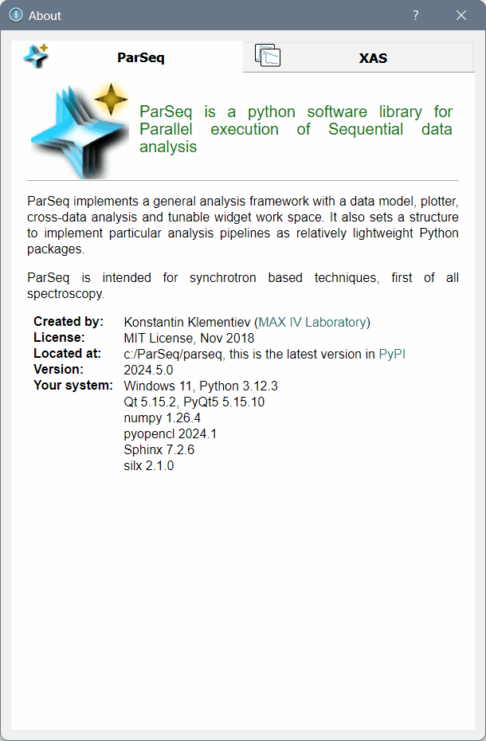

EXAFS analysis pipeline
=======================

A pipeline for the [ParSeq framework](https://github.com/kklmn/ParSeq) that
implements data processing of EXAFS spectra.

This pipeline also serves as an example for creating analysis nodes,
transformations that connect these nodes and widgets that set options and
parameters of the transformations.

  

  

Dependencies
------------

* [ParSeq](https://github.com/kklmn/ParSeq) -- the framework package,
* [silx](https://github.com/silx-kit/silx) -- used for plotting and Qt imports.

How to use
----------

Either install ParSeq and this pipeline application by their installers or put
their folders `parseq` and `parseq_XAS` near by (i.e. in the same folder) and
run `python XAS_start.py --help` to see the accepted options. Run the pipeline
as `python XAS_start.py`. Load a ready project from `saved` folder from the GUI
or from the starting command line.
